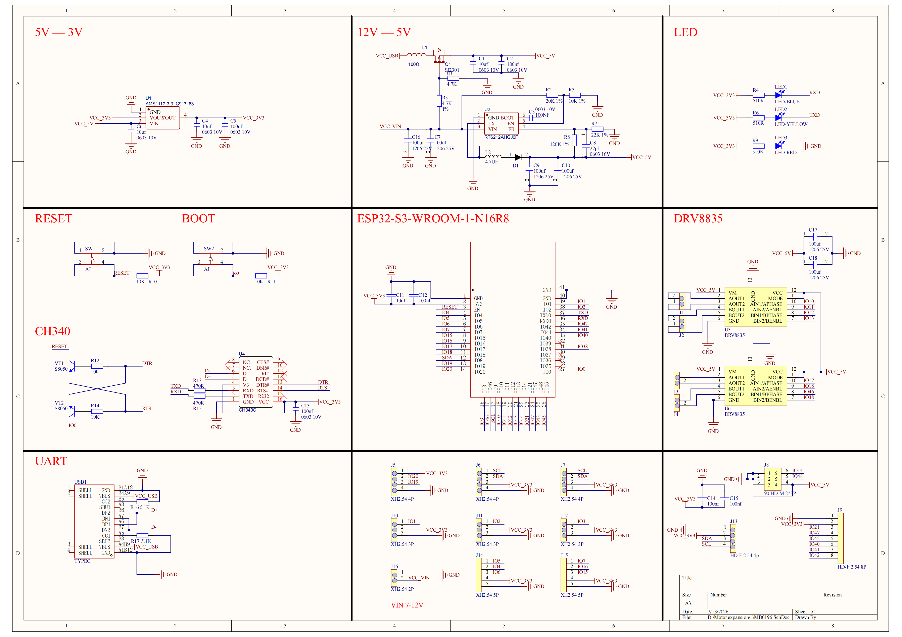
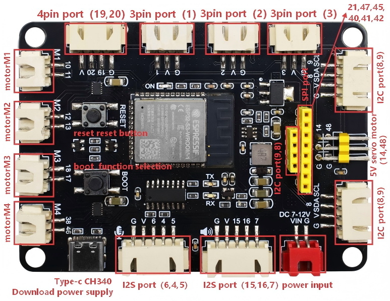
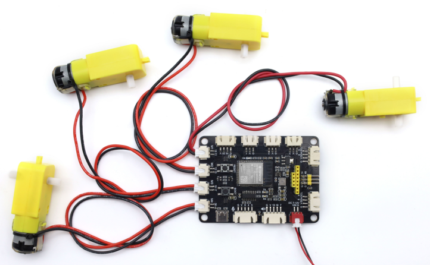
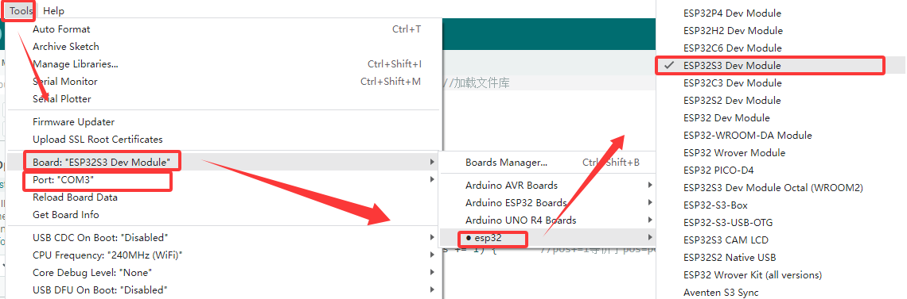

# MB0196 S3 AI Rover Development Board


## 1. Introduction

The S3 AI Rover main controller is equipped with the ESP32-S3-WROOM-1-N16R8 module, featuring 16MB Flash and 8MB PSRAM. It includes a mature power management solution, dual DRV8835 four-channel motor drivers, and rich peripheral interfaces, covering I2S audio, dual screen interfaces (SPI and I2C), ultrasonic sensors, servo expansions, and more. It is suitable for various development scenarios such as AI voice-controlled cars, Wi-Fi remote-controlled robots, and educational programmable chassis. The board also reserves Reset and BOOT function buttons to facilitate debugging and network configuration.

## 2. Specifications

### 2.1 Main Controller Specifications

- **Main Chip**: ESP32-S3-WROOM-1-N16R8, Dual-core Xtensa LX7, maximum clock frequency of 240MHz
- **Storage**: 16MB Flash + 8MB PSRAM
- **Wi-Fi**: Supports IEEE 802.11b/g/n protocol, 2.4GHz band with 20/40MHz bandwidth, 1T1R mode with rates up to 150Mbps; supports Station, SoftAP, and Promiscuous modes
- **Bluetooth**: Bluetooth Low Energy 5.0, supports Bluetooth Mesh, maximum transmit power of 20dBm, rates from 125Kbps to 2Mbps
- **Security Mechanisms**: Supports secure boot and Flash encryption; built-in hardware accelerators for AES-128/256, SHA, RSA, and a random number generator
- **Power Management**: Supports Active, Modem-sleep, Light-sleep, and Deep-sleep modes; power consumption as low as 7µA in Deep-sleep mode

### 2.2 Power and Electrical Characteristics

- **VIN Input Voltage**: 7~12V DC, main power supply for the entire unit
- **VCC_5V**: RT6212 DC-DC step-down output, maximum continuous current 2A, used for powering motor drivers and servo interfaces
- **VCC_3V3**: AMS1117-3.3 regulated output, maximum output current 900mA, used for powering extended peripherals
- **Download Pathway**: CH340C USB-to-Serial converter, Type-C interface for 5V power supply and program downloading
- **Board Dimensions**: 88mm × 64mm
- **Environmental Compliance**: RoHS compliant

### 2.3 On-board Drivers and Peripheral Specifications

- **Motor Driver**: 2x DRV8835 chips, enabling independent four-wheel drive
- **Screen Interface**: Dual screen interfaces — 8-pin SPI LCD port and 4-pin I2C screen port
- **Audio Interface**: Full I2S hardware suite, microphone input paired with amplifier-stage speaker output

## 3. Working Principle



1. **Power Interface**: There are two types of connection interfaces for the external power supply. One is the Type-C input of 5V, suitable for light-load main controller downloading and low-power peripheral operation. The other is the VIN input of 7~12V high-power supply. Two regulation paths output 5V and 3.3V respectively to power motor drivers, servos, and various sensors separately, avoiding mutual power interference.

2. **Motion Control**: The ESP32-S3 outputs direction level signals and PWM speed control signals to the DRV8835. The driver chips amplify the current to drive the four DC motors, achieving forward movement, backward movement原地 turning, and speed adjustment. Two independent IOs output PWM signals for servos, with on-board 5V power ensuring stable servo torque.

3. **Multimedia Interface**: The I2S bus handles microphone audio capture and speaker audio playback; the SPI bus and I2C bus drive the two types of screens respectively.

4. **Interaction and Debugging**: The BOOT button can be configured for functions such as voice wake-up and mode switching. The RST reset button performs a hard restart of the entire unit.

## 4. Peripheral Ports



| Port Type | Port/Function | Pin/Interface |
| :--- | :--- | :--- |
| Motor Driver | Motor Port 1 | DIR=GPIO10, PWM=GPIO11 |
| Motor Driver | Motor Port 2 | DIR=GPIO12, PWM=GPIO13 |
| Motor Driver | Motor Port 3 | DIR=GPIO17, PWM=GPIO18 |
| Motor Driver | Motor Port 4 | DIR=GPIO46, PWM=GPIO38 |
| Servo | Servo Channel 1 | SIG=GPIO14 (VCC_5V) |
| Servo | Servo Channel 2 | SIG=GPIO48 (VCC_5V) |
| SPI Screen | 8-pin LCD Port | SCLK=GPIO21, MOSI=GPIO47, CS=GPIO41, DC=GPIO40, RST=GPIO45，BLK=GPIO42 |
| I2C Screen | 4-pin I2C Screen Port | SCL=GPIO9, SDA=GPIO8 |
| Ultrasonic | Ultrasonic Port | GPIO20, GPIO19 |
| I2S Audio | Microphone Input | BCLK=GPIO5, WS=GPIO4, DIN=GPIO6 |
| I2S Audio | Speaker Amplifier Output | BCLK=GPIO15, WS=GPIO16, DOUT=GPIO7 |
| Expansion Header | Multi-spec General Expansion | 3Pin/4Pin/5Pin XH 2.54mm interfaces, exposing GPIOs (including I2C: SDA=GPIO8, SCL=GPIO9) |
| Button | BOOT Button | GPIO0 |
| Button | RST Button | Hardware Reset |
| Power Supply | Type-C Port | 5V Input, Program Download |
| Power Supply | VIN Power Jack | 7~12V DC Input |

## 5. Hardware Wiring

Required Core Hardware

| Component | Quantity | Remarks |
| :--- | :--- | :--- |
| S3 AI Rover Development Board | 1 | Main Control Board |
| DC Geared Motor | 4 | XH2.54 Terminal Wire |
| DC power | 1 | 7-12V |
| Type-C Data Cable | 1 | Program Download and Debugging |

**Note**: The pin arrangement for DIR/PWM on the XH2.54 terminals for motors M1/M2 differs from that of M3/M4. To unify the motion direction of all four motors, swap the wire order of the two wires inside the XH2.54 terminal for either M1/M2 or M3/M4 before inserting.

Wiring Diagram



## 6. Environment and Code

### 6.1 Development Environment Setup

1. **Install Arduino IDE**: Please refer to the [Arduino IDE Installation Tutorial](https://www.keyesrobot.cn/projects/Arduino). The tutorial includes instructions for installing the ESP32 chip package (you may choose the latest version details omitted here).

2. **Select Board**: Open Arduino IDE, click `Tools` → `Board` → `esp32` → `ESP32S3 Dev Module`.

3. **Select Port**: Connect the development board to your computer using a Type-C data cable. Click `Tools` → `Port` and select the newly added serial port number. (If no new serial port appears, check if the [CH340 driver](https://www.keyesrobot.cn/projects/Arduino) is installed or try replacing the USB data cable.)



4. **Upload Program**: Copy the example code into the IDE and click the Upload button to complete the flashing process.

### 6.2 Example: Four-Channel Motor Test

```arduino
#include <ESP32PWM.h>
ESP32PWM pwm_m1, pwm_m2, pwm_m3, pwm_m4;
int m4_dir = 46, m4_pwm = 38;
int m3_dir = 17, m3_pwm = 18;
int m2_dir = 12, m2_pwm = 13;
int m1_dir = 10, m1_pwm = 11;
const int speed = 50;

void setup(){
  Serial.begin(115200);
  pinMode(m1_dir, OUTPUT);
  pinMode(m2_dir, OUTPUT);
  pinMode(m3_dir, OUTPUT);
  pinMode(m4_dir, OUTPUT);
  pwm_m1.attachPin(m1_pwm, 490, 8);
  pwm_m2.attachPin(m2_pwm, 490, 8);
  pwm_m3.attachPin(m3_pwm, 490, 8);
  pwm_m4.attachPin(m4_pwm, 490, 8);
  Serial.println("Motor initialization complete");
}

// Mode 1: All four channels forward
void forward(int sp){
  digitalWrite(m1_dir, HIGH);
  digitalWrite(m2_dir, HIGH);
  digitalWrite(m3_dir, HIGH);
  digitalWrite(m4_dir, HIGH);
  pwm_m1.write(sp);
  pwm_m2.write(sp);
  pwm_m3.write(sp);
  pwm_m4.write(sp);
}

// Mode 2: All four channels reverse
void back(int sp){
  digitalWrite(m1_dir, LOW);
  digitalWrite(m2_dir, LOW);
  digitalWrite(m3_dir, LOW);
  digitalWrite(m4_dir, LOW);
  pwm_m1.write(sp);
  pwm_m2.write(sp);
  pwm_m3.write(sp);
  pwm_m4.write(sp);
}

// Mode 3: M1-M2 forward, M3-M4 reverse
void turnLeft(int sp){
  digitalWrite(m1_dir, HIGH);
  digitalWrite(m2_dir, HIGH);
  digitalWrite(m3_dir, LOW);
  digitalWrite(m4_dir, LOW);
  pwm_m1.write(sp);
  pwm_m2.write(sp);
  pwm_m3.write(sp);
  pwm_m4.write(sp);
}

// Mode 4: M1-M2 reverse, M3-M4 forward
void turnRight(int sp){
  digitalWrite(m1_dir, LOW);
  digitalWrite(m2_dir, LOW);
  digitalWrite(m3_dir, HIGH);
  digitalWrite(m4_dir, HIGH);
  pwm_m1.write(sp);
  pwm_m2.write(sp);
  pwm_m3.write(sp);
  pwm_m4.write(sp);
}

// Stop motors
void stopCar(){
  pwm_m1.write(0);
  pwm_m2.write(0);
  pwm_m3.write(0);
  pwm_m4.write(0);
}

void loop(){
  forward(speed);     // All four channels forward for 2 seconds
  delay(2000);
  back(speed);        // All four channels reverse for 2 seconds
  delay(2000);
  turnLeft(speed);    // M1-M2 forward, M3-M4 reverse for 2 seconds
  delay(2000);
  turnRight(speed);   // M1-M2 reverse, M3-M4 forward for 2 seconds
  delay(2000);
  stopCar();          // Stop for 1 second
  delay(1000);
}
```

## 7. Test Results

After uploading the above motor code, the car will periodically perform the following sequence: forward for 2s, reverse for 2s, M1-M2 forward/M3-M4 reverse for 2s, M1-M2 reverse/M3-M4 forward for 2s, and pause for 1s. The four wheels start and stop smoothly, and the speed adjustment range of 0~255 shows significant effect.

## 8. Troubleshooting Common Issues

1. **Upload Failure**: Check if the data cable only supports charging; reinstall the CH340 driver.
2. **Motors Not Moving**: Check if the VIN high-power supply is properly connected.
3. **Peripheral Damage**: Ensure that all external sensors (except for the motor and servo) are uniformly powered by 3.3V.
4. **Abnormal Screen Display**: Check and adapt the ribbon cable arrang